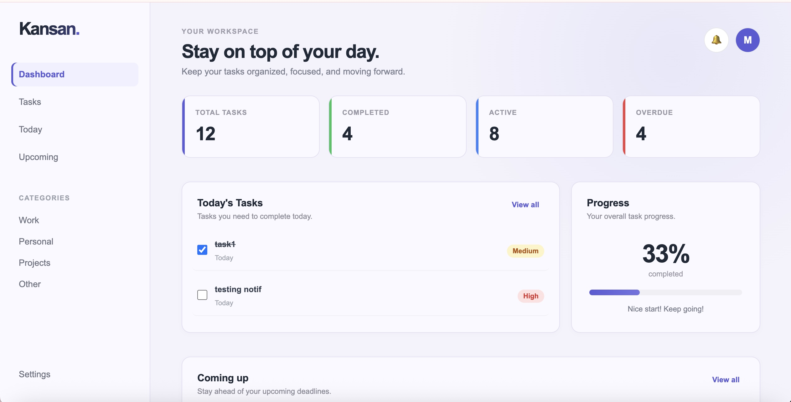
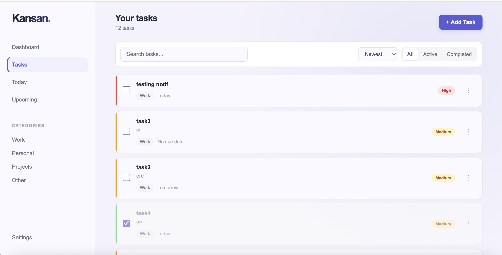
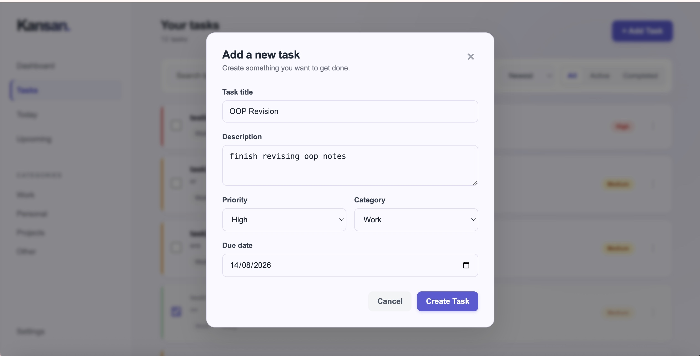

# 🟣 Kansan — Task Manager

> **Plan it. Prioritize it. Get it done.**

Kansan is a sleek task management application built to make organizing everyday work simple, visual, and actually satisfying.

From creating and prioritizing tasks to tracking deadlines, monitoring progress, and staying on top of what's due — Kansan keeps everything in one focused workspace.

---

## ✨ Features

### 📊 Dashboard
Get an instant snapshot of your workload.

- Total, active, completed & overdue task statistics
- 📅 Today's tasks
- 🔜 Upcoming tasks
- 📈 Overall completion progress
- 💬 Dynamic progress messages

### ✅ Task Management
Everything you need to manage your tasks from start to finish.

- ➕ Create tasks with descriptions, priorities, categories & due dates
- ✏️ Edit existing tasks
- ☑️ Mark tasks as completed
- 🗑️ Delete tasks with confirmation
- 💾 Tasks persist between sessions

### 🔎 Search, Filter & Sort
Find exactly what you're looking for.

- 🔍 Search by task title or description
- 🟢 Filter by active or completed status
- 🏷️ Filter by category
- 🆕 Sort by newest or oldest
- 📅 Sort by due date
- 🔥 Sort by priority

### 📅 Deadline Tracking
Never lose sight of what's coming up.

- 🟣 Dedicated **Today** view
- 🔜 Dedicated **Upcoming** view
- ⚠️ Automatic overdue detection
- 🔔 Notifications for overdue tasks
- 📌 Notifications for tasks due today

### 🎨 Personalization
Make the workspace feel like yours.

- ☀️ Light theme
- 🌫️ Soft theme
- ⭐ Configurable default task priority
- 💾 Preferences persist between sessions

---

## 🖥️ Preview

### 📊 Dashboard



### 📋 Task Management



### ➕ Create a Task



---

## 🛠️ Built With

| Technology | Role |
|---|---|
| 🧱 **HTML5** | Application structure |
| 🎨 **CSS3** | Layout, styling & UI |
| ⚡ **JavaScript** | Application logic & interactions |
| 💾 **Local Storage** | Persistent task & preference data |
| 🔧 **Git** | Version control |

---

## ⚙️ How It Works

Kansan maintains a centralized task state that powers the dashboard, task views, statistics, progress tracking, and notifications.

User interactions dynamically update the interface through event-driven logic, while Local Storage keeps task data and preferences available across sessions.

Search, filtering, sorting, navigation, completion states, deadline calculations, and notifications all respond to changes in the current task state.

---

## 🚀 Getting Started

### 1️⃣ Clone the repository

```bash
git clone https://github.com/maheenakbar8/kansan-task-manager.git